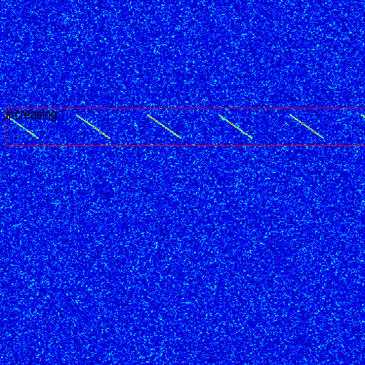
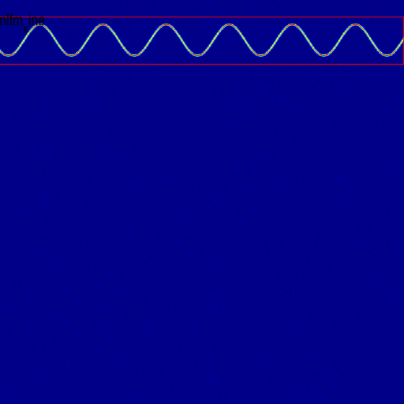
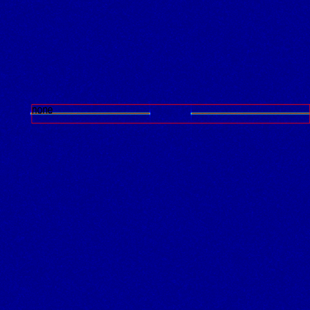
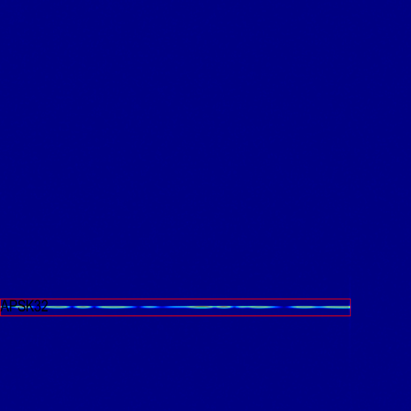
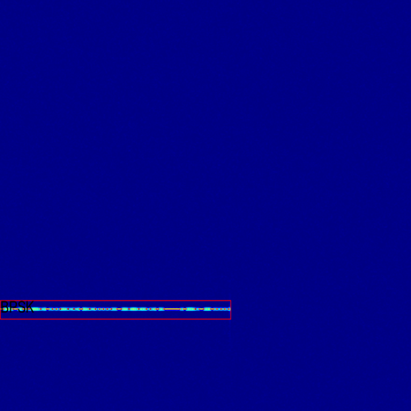
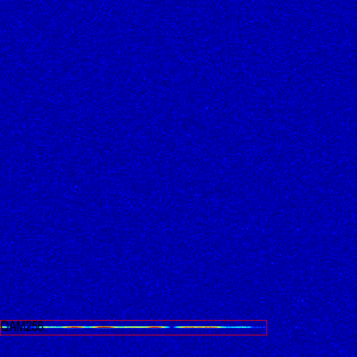
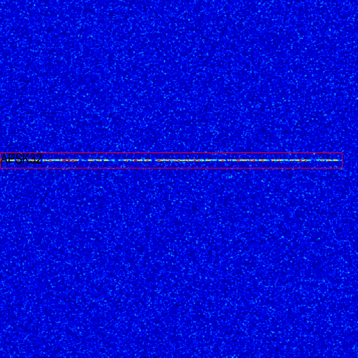
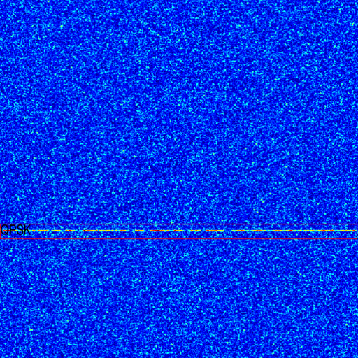
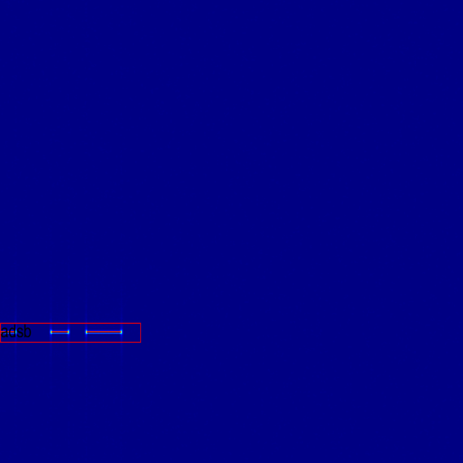

<!--
 * @Date: 2025-08-17 10:33:03
 * @LastEditors: thomas-smith123 thomas-smith@live.cn
 * @LastEditTime: 2025-08-24 16:05:34
 * @FilePath: \MG-orphan\README.md
-->

### 使用Matlab产生 （Generate Modulation using Matlab）
- "BPSK"
- "BPSK_X"
- "QPSK"
- "OQPSK"
- "8-PSK"
- "QAM8"
- "QAM16"
- "QAM32"
- "QAM64"
- "QAM128"
- "QAM256"
- "QAM512"
- "APSK16"
- "APSK32"
- "APSK64"
- "APSK128"
- "none (sine pulse)"
- "increasing (lfm)"
- "v-shape (lfm v-shape)"
- "nlfm_sine"
- "ads-b (ppm)"

### 样本（Examples）

生成部分的样本如下（不限于）

Generated samples are partly shown below

</img>
</img>
</img>
</img>
</img>

</img>
</img>
</img>
</img>
</img>

### 软件（Software）

使用时可能需要先安装keysight M8195任意波信号发生器的相关驱动套件，才能使用Matlab进行调用。

Driver kit of the keysight M8195 may be needed to install the before use Matlab to make calls.

基础代码从是德的网站下载，从<a href=https://www.keysight.com.cn/cn/zh/support/M8195A/65-gsa-s-arbitrary-waveform-generator.html#driversl>这里</a>进入。

Basic code can be download form Keysight's website. Visit from <a href=https://www.keysight.com.cn/cn/zh/support/M8195A/65-gsa-s-arbitrary-waveform-generator.html#drivers>here</a>.

是德的原始的Matlab代码从<a href=https://www.keysight.com.cn/cn/zh/lib/software-detail/computer-software/keysight-iqtools.html>这里</a>进入下载。依赖的驱动从<a href=https://www.keysight.com.cn/cn/zh/lib/software-detail/computer-software/io-libraries-suite-downloads-2175637.html>这里</a>进入下载

The origin Keysight Matlab application can be download from <a href=https://www.keysight.com.cn/cn/zh/lib/software-detail/computer-software/keysight-iqtools.html>here</a>. And prerequsite can be download from <a href=https://www.keysight.com.cn/cn/zh/lib/software-detail/computer-software/io-libraries-suite-downloads-2175637.html> here </a>.

可能需要arbConfig.mat文件，链接<a href="arbConfig.mat">在此</a>，按照要求复制到对应的文件夹就行。

arbConfig.mat may needed, link <a href="arbConfig.mat">is here</a>, move it to distination according to the notice if needed.

### 主要文件(main file)

main file: main_gen.m

config file: keysight_signal_gen.m

