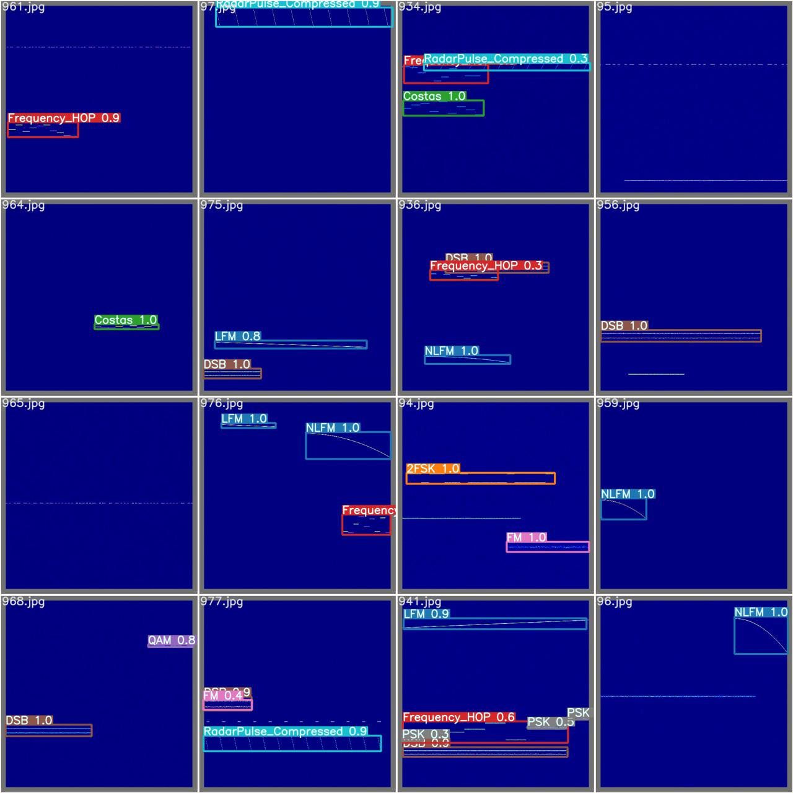

## 文件说明
支持的信号样式
```
- [x] LFM
- [x] nFSK
- [x] FM窄带
- [x] nPSK
- [x] nQAM
- [x] AM
- [x] DSB
- [x] RADAR Pulse
- [x] RADAR Pulse LFM
- [x] NLFM
- [x] ADS-B
```
## 图像要求
**图像大小**先定义为采样点数的平方，例如512点fft最后给出图像的大小为512*512。


## 20231210
### 202312101709
注意事项全部写到bookmark里面了，方便查找。
### 202312102021
LFM的框选完成，确认没有问题了。

后续任务：添加其他信号样式。
### 202312102207
nFSK完成了，明天继续。

## 20231211
### 202312112230
下班了，把大部分的调制信号给搞定了，现在还差OFDM这种还没搞，明天看情况。
明天的目标是把信号的出现规则给搞了，然后再生成图片。如果有时间再继续调试细节。

## 20231212
### 202312121539
ADS-B信号也完成了。

### 202312121640
对stft的点数啥的进行了调整，可以适应不同的窗长和重叠点数的大小。
下一步：整理信号产生逻辑，把产生iq点数的函数换成__call__(self)


### 202312122322
上面说的都搞完了，剩下的就是微调一下参数，重点解决一下重叠问题（需要吗？）
然后就是在matlab上面看下频谱，可能差的有点多。可能图像的像素不够，被压缩了。

## 20231213
公祭日，勿忘国耻，牢记使命！
### 202312131531
准备放弃使用matplotlib
直接搞成灰度图就好了，就用CV2的库呗。
### 202312131719
基本功能已经实现了，再把NLFM的代码改一下就好了，调一下斜率这样的。
### 202312122052
就这样了，可以开始搭网络了。

## 20231214
### 202312141546
数据拉框的这个还得改一下，网络好像已经能跑起来了。nice！
把拉框的程序改一下。
记录一下踩的坑
数据文件的结构
```
.  ## DataSet 文件夹
├── dataSet
├── images ## 所有的图片都放在这里
│   ├── 0.jpg
│   ├── ........
│   └── 9.jpg
├── labels ## 
│   ├── 0.txt
│   ├── ........
│   └── 9.txt
├── test.txt ## 这个很重要，路径可能要跟一下代码，这里的路径给的是'./images/127.jpg'
├── train.cache ## 这个文件是yolo的代码自己建的
├── train.txt
├── valid.cache
└── valid.txt
```
### 最后一次
网络已经能跑起来了。

## 20231215
### 202312150947
将图像修改之后准确度确实好一些了，准确度提高了好几个点。但是基本都还没过50%。
```todo
- [x] 考虑将nPSK归为一类
- [-] 然后看看能不能修改锚框
- [x] 新增信号样式：costas
- [x] 加入MSK ##有点问题，不知道能不能行 ## 直接用FSK代替了
```

## 20231216
### 202312161759
把Costas频率编码和Frank相位编码给搞好了，然后调整了STFT的相关参数，把模式从PSD改成幅度模式。
STFT的其他参数没改，减小了每张图中信号的最大数量。

## 20231217
### 202312172205
把信号的类型稍微调整了一下，信号重叠的问题有了一些解决，但是还是有些分不清楚的东西。
先跑跑看，然后看下结果怎么样。

## 20231218
### 202312180855
看了下昨天跑的结果，对PSK和相位编码的识别就是不太行。
完了之后就是LFM脉冲的识别准确度不太行。
信号类型
```
"LFM",# 0
"2FSK",# 1 ==> MSK
"Costas",# 2
"Frequency_HOP",# 4
"QAM",# 4
"DSB", # 5 #@audit DSB总是很淡
"FM",# 6
"PSK",# 7
"RadarPulse",# 8
"RadarPulse_Compressed",# 9
"NLFM",# 10
"ADSB",# 11
```
这样的话还得再改改了。
结果如下图所示。在信号有交叠的时候识别准确度较低。
</img>
### 202312182003
大改了一版，信号全部用上了绝对时间和频率。

## 20231219
### 202312191013
把上一次的修改了一些细节。
### 202312191430
换成了绝对参数，有所提升，但是ADSB信号还是提升不大，但是起码能够检出来一些了。
### 202312192248
下面这张图有用，明天加上一点注意力机制，想办法解决长信号检测不行的问题。


## 20231220
### 202312201443
得到目前效果最好的一组，exp9。

试试继续用其他数据炼丹。
### 202312201710
网络还是得多跑才行啊，加epoch之后出现较大改观，而且用1024的图整完之后换512*512再搞效果好很多。
给网络加了一版CBAM注意力机制，慢慢跑着了。

## 20231221
### 202312211441
给网络喂够数据就好很多了，而且加上注意力的网络比没有注意力的还能好几个点。很nice。
### 202312211634
尝试进行网络的部署，导出了onnx的模型。`export.py`只是把模型进行打包了，图片还没整。
后续就可以使用torch直接调用模型来做推理了，也不知道效果怎么样。

检测中画出网格的代码在100~157的代码中，如下所示。
```python
if len(det):
    # Rescale boxes from img_size to im0 size
    det[:, :4] = scale_coords(img.shape[2:], det[:, :4], im0.shape).round()

    # Print results
    for c in det[:, -1].unique():
        n = (det[:, -1] == c).sum()  # detections per class
        s += f"{n} {names[int(c)]}{'s' * (n > 1)}, "  # add to string

    # Write results
    for *xyxy, conf, cls in reversed(det):
        if save_txt:  # Write to file
            xywh = (xyxy2xywh(torch.tensor(xyxy).view(1, 4)) / gn).view(-1).tolist()  # normalized xywh
            line = (cls, *xywh, conf) if opt.save_conf else (cls, *xywh)  # label format
            with open(txt_path + '.txt', 'a') as f:
                f.write(('%g ' * len(line)).rstrip() % line + '\n')

        if save_img or view_img:  # Add bbox to image
            label = f'{names[int(cls)]} {conf:.2f}'
            plot_one_box(xyxy, im0, label=label, color=colors[int(cls)], line_thickness=1)
```
准备使用onnx来进行网络的部署和调用
`pip install onnxruntime-gpu -i https://pypi.tuna.tsinghua.edu.cn/simple some-package`
### 202312212121
有点问题，注意onnx的环境
```
ONNX Runtime: 1.16
CUDA: 11.6~11.8
cuDNN: 8.2.4
```

### 202312212308
部署的东西还得稍微改一下，`dediction.py`，输入图片进去没问题，但是直接给矩阵好像就不太对。扔进去的图像是要归一化的图像才行。
另外，取特征出来需要从检测头的输入部分整出来，估摸着应该好说。
明天继续。

## 20231222
### 202312221558
类外检测估计会有点问题。

## 20231223
### 202312231616
如果靠锚框圈出来的图像再进行padding，应该是不太行的，获取不了图片的整体的特征状态。
是否需要考虑网络的多标签分类，然后提取特征？

## 20231225
### 202312252136
stft速度喜人，还得改，慢死了。

## 20231226
### 202312261007
skcuda的cufftPlanMany终于配通了，有坑。
```python
## 库文件中对参数的定义，要按照argtypes中的类型进行转换，
## 其中，参数是空指针的要现在前面定义出来
_libcufft.cufftPlanMany.argtypes = [ctypes.c_void_p,
                                    ctypes.c_int,
                                    ctypes.c_void_p,
                                    ctypes.c_void_p,
                                    ctypes.c_int,
                                    ctypes.c_int,
                                    ctypes.c_void_p,
                                    ctypes.c_int,
                                    ctypes.c_int,
                                    ctypes.c_int,
                                    ctypes.c_int]
def cufftPlanMany(rank, n,
                  inembed, istride, idist,
                  onembed, ostride, odist, fft_type, batch):
    """
    Create batched FFT plan configuration.

    References
    ----------
    `cufftPlanMany <http://docs.nvidia.com/cuda/cufft/#function-cufftplanmany>`_
    """

    plan = _types.plan()
    status = _libcufft.cufftPlanMany(ctypes.byref(plan), rank, n,
                                     inembed, istride, idist,
                                     onembed, ostride, odist,
                                     fft_type, batch)
    cufftCheckStatus(status)
    return plan
## 先要定义出来指针类型的东西
n = np.array([1],dtype=np.int32)
p = ctypes.c_int(1)
t = ctypes.pointer(p)
n = ctypes.c_int(self.nfft)
n_p = ctypes.pointer(n)

cf.cufftPlanMany(rank=1, n=n_p, inembed=t, istride=1, idist=257,onembed=t, ostride=1, odist=257, fft_type=cf.CUFFT_C2C, batch=512)
```
### 202312262125
pycuda和ONNX_engine好像有点冲突。

## 20231227
### 202312271717
先push一个，程序可以跑通了，但是对不对就不知道了。

## 20240301
### 202403011553
把调用matlab的信号产生的东西搞差不多了，先push一个，应该还凑合。

## 20240516
### 202405160231
矩阵的归一化应该还是有点问题的。

## 20240517
### 202405161625
现在应该算全部调通了，bn层应该是有些地方self.eps所放置的位置不合适。现在已经解决，准备大量进行训练来测试了。

## 20240526
### 202405262337
怎么说呢，一言难尽，问题始终是在复数的二维批归一化上，如果走二维矩阵化二维正态分布，非正定矩阵开方将会导致Nan；尝试1. 直接不要bn层；尝试2. 将复数当成实数来求方差这样的，这样才不会出现开方后nan
.