<!--
 * @Date: 2025-08-17 10:33:03
 * @LastEditors: thomas-smith123 thomas-smith@live.cn
 * @LastEditTime: 2025-08-22 18:03:48
 * @FilePath: \undefinedc:\jiangrd3\MG-orphan\README.md
-->

    

        使用Matlab产生数据集的代码从<a href='https://github.com/thomas-smith123/MG-orphan/tree/Dataset-Matlab?tab=readme-ov-file'>这里</a>进入。
    

    

        使用python产生数据集的代码从<a href='https://github.com/thomas-smith123/MG-orphan/tree/main?tab=readme-ov-file'>这里</a>进入。
    

    <h1>使用RadioML2018.01a进行调制方式识别。</h1>

    由于<a href='https://www.deepsig.ai/datasets/'>RadioML2018.01a</a>数据集也不再被支持，因此，本项目也仅供参考。

    我们所使用的数据集仅为MPSK、MQAM、MAPSK等，我们直接从RadioML2018.01a中将这几种调制方式提取出来，然后随机划分训练集和测试集，比例大约是9:1。然后固定随机数种子进行训练。训练结果如下：

    

        
SNR vs Accuracy

        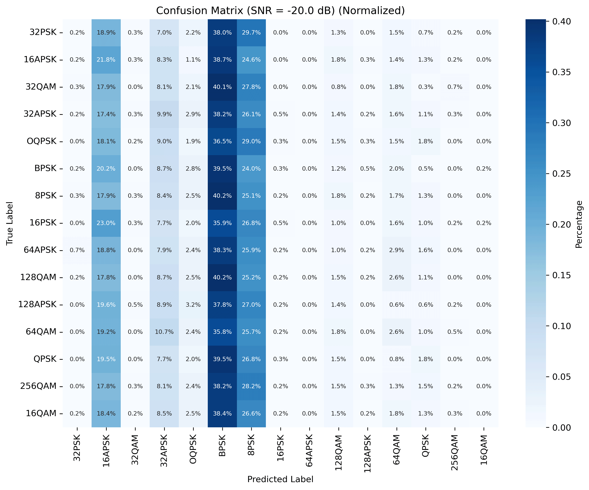</img>
    

    

        
Overall Accuracy

        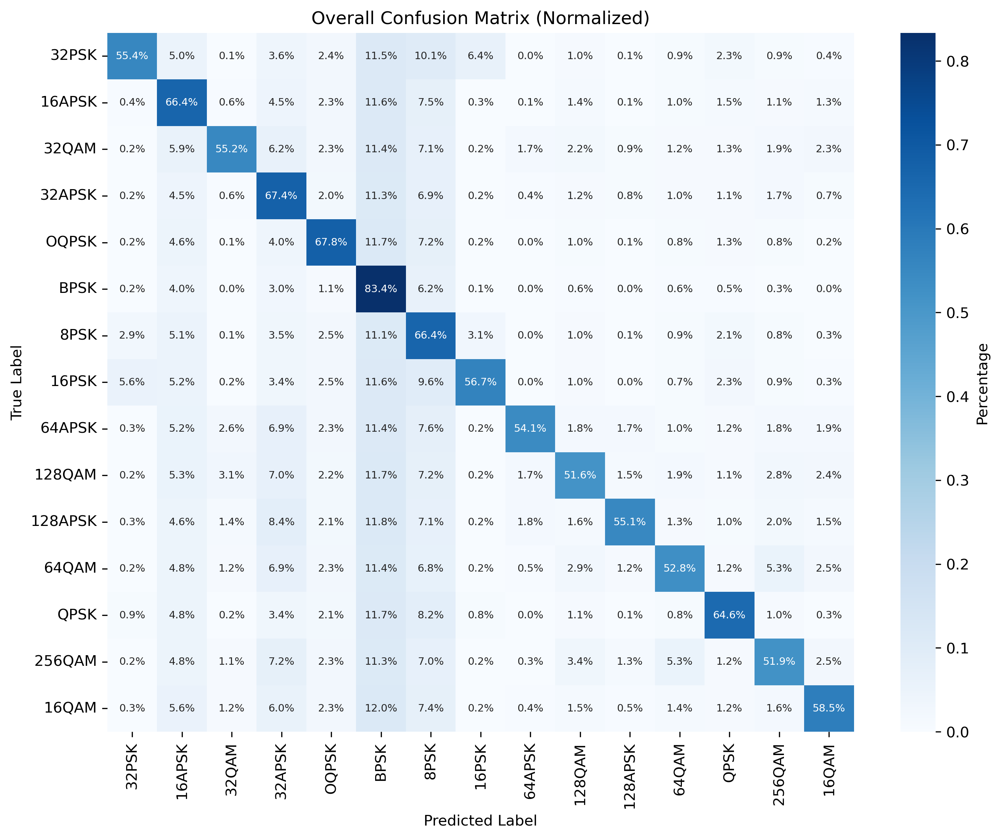</img>
    

    

        
SNR vs Overall Accuracy

        </img>
    

<!-- 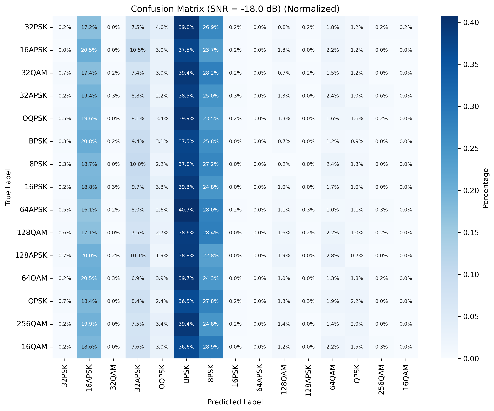</img>
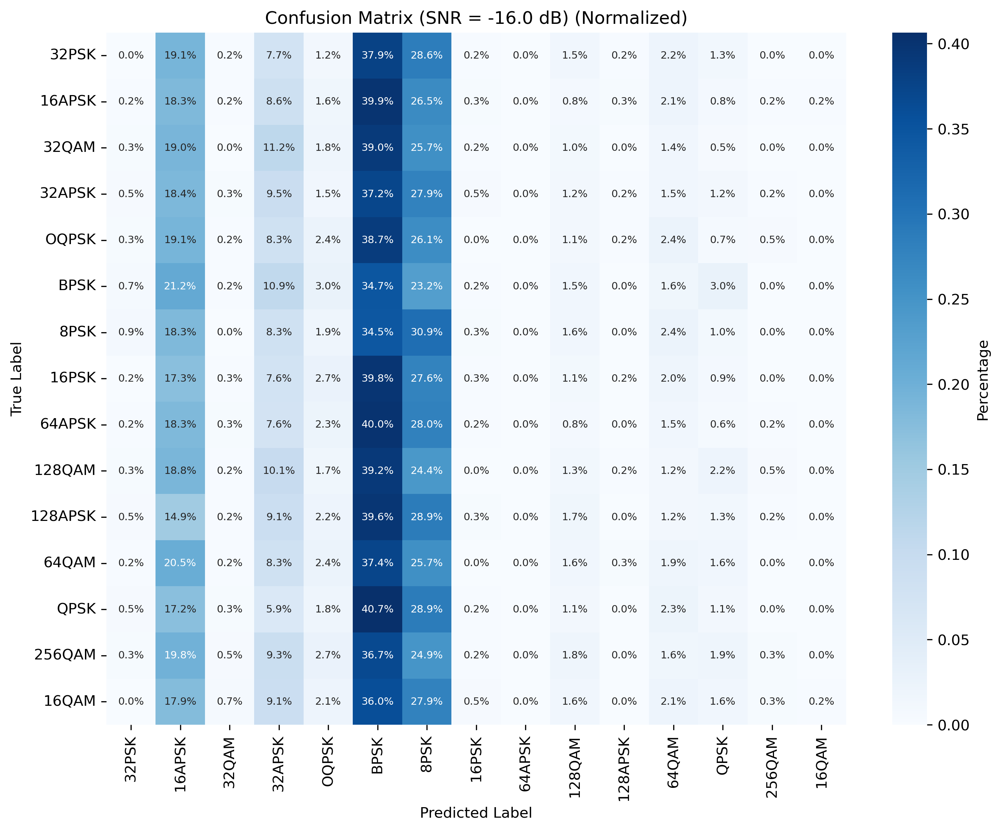</img>
</img>
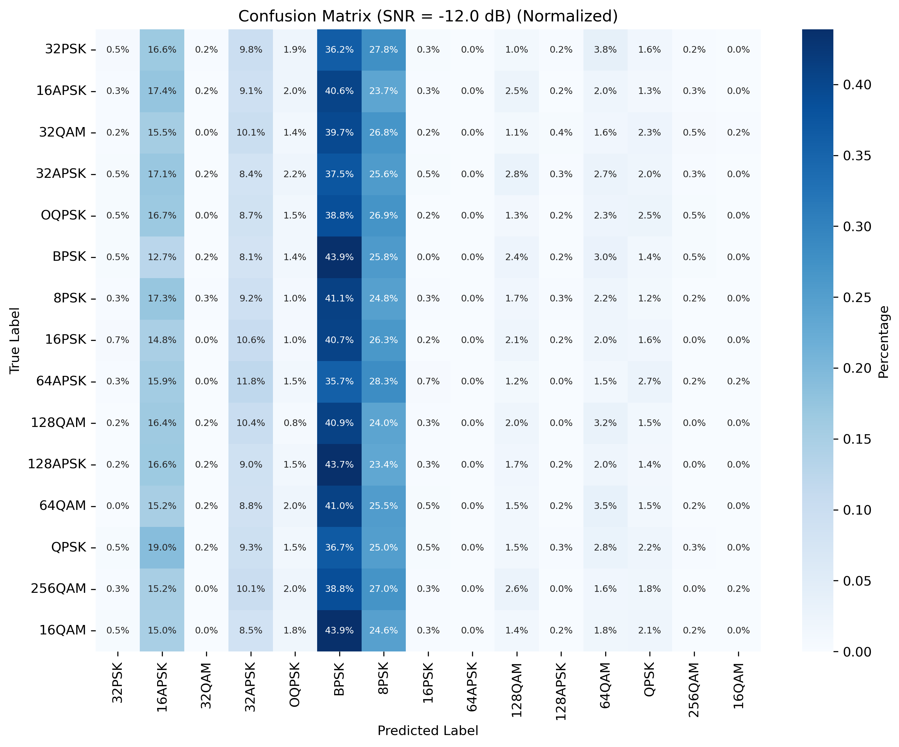</img>
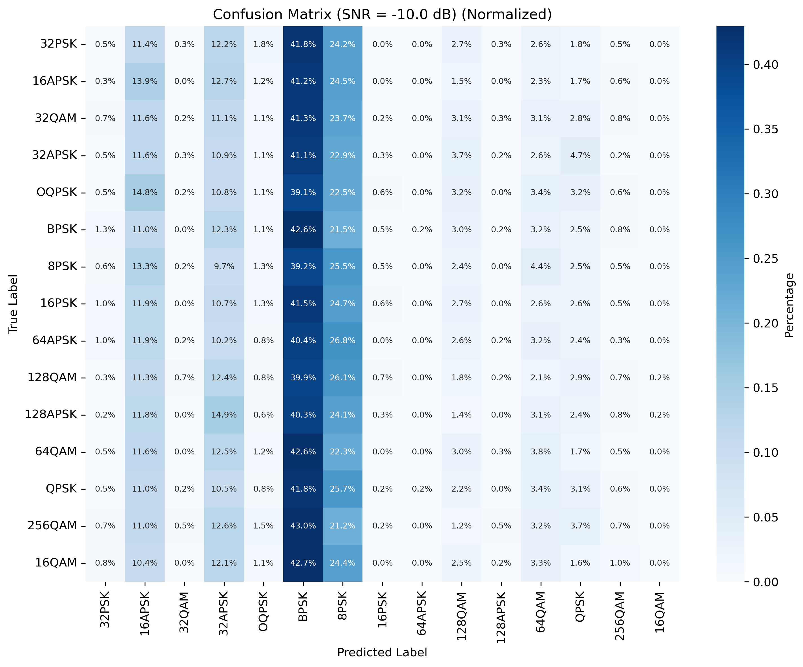</img>
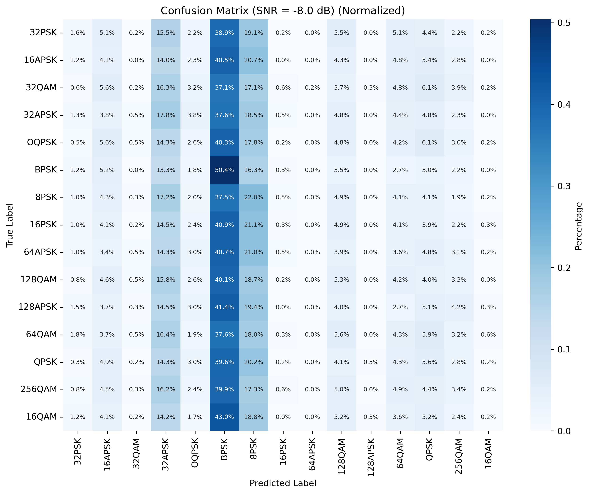</img>
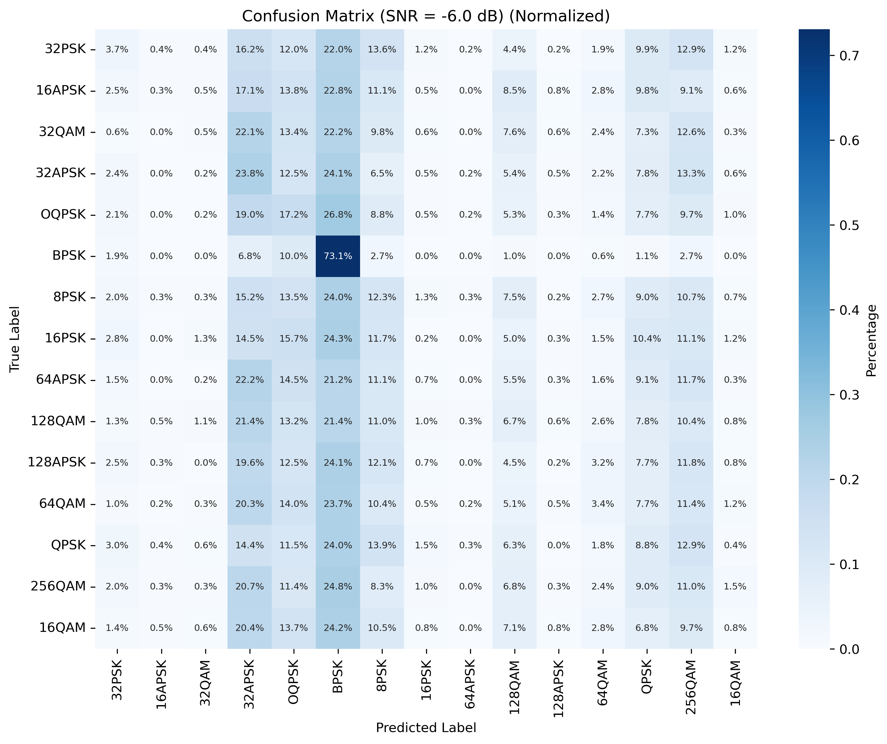</img>
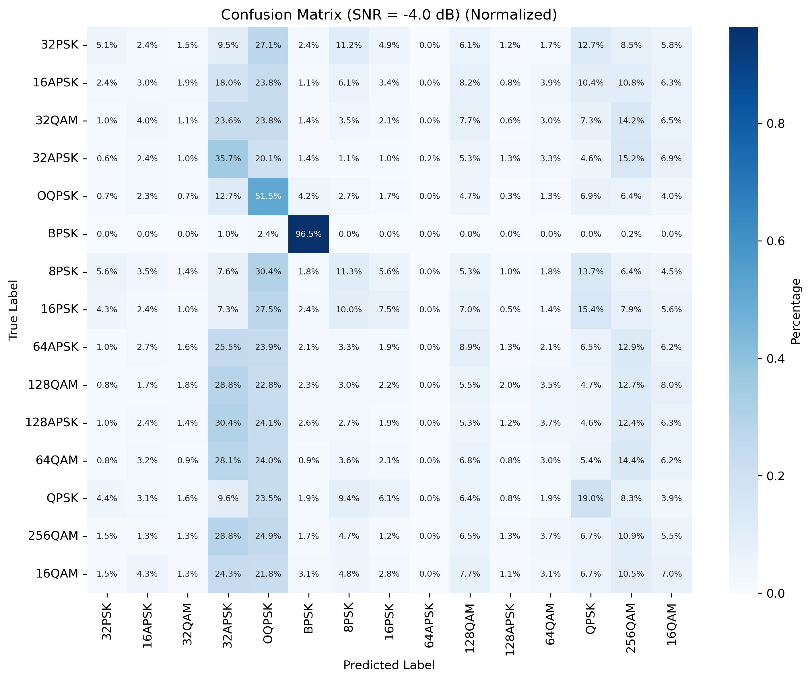</img>
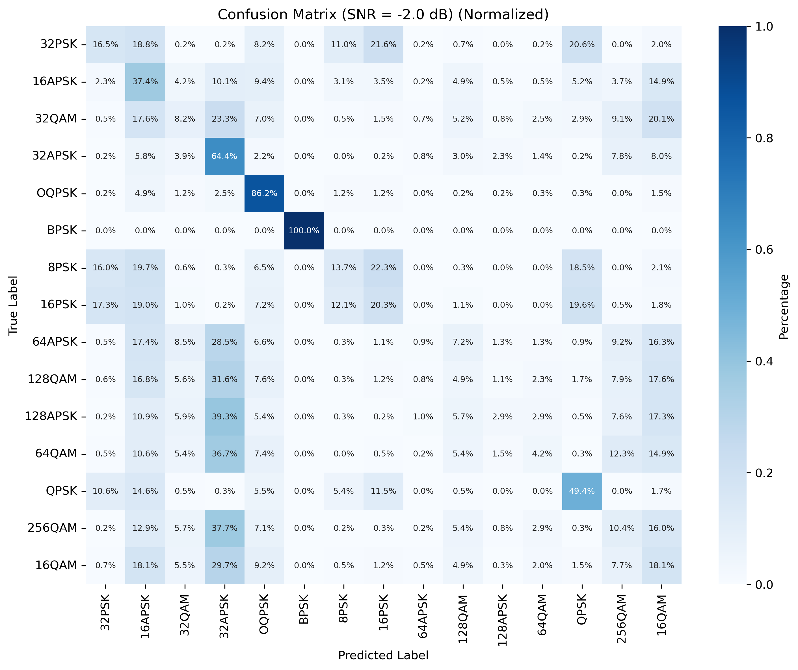</img>
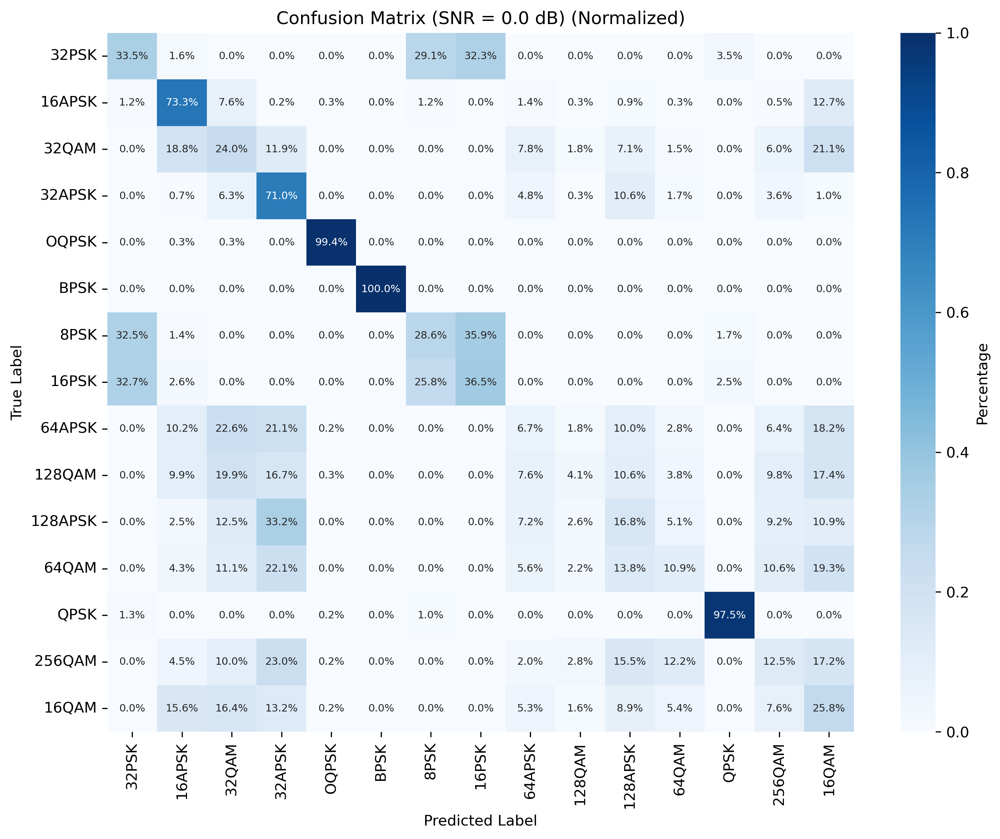</img>
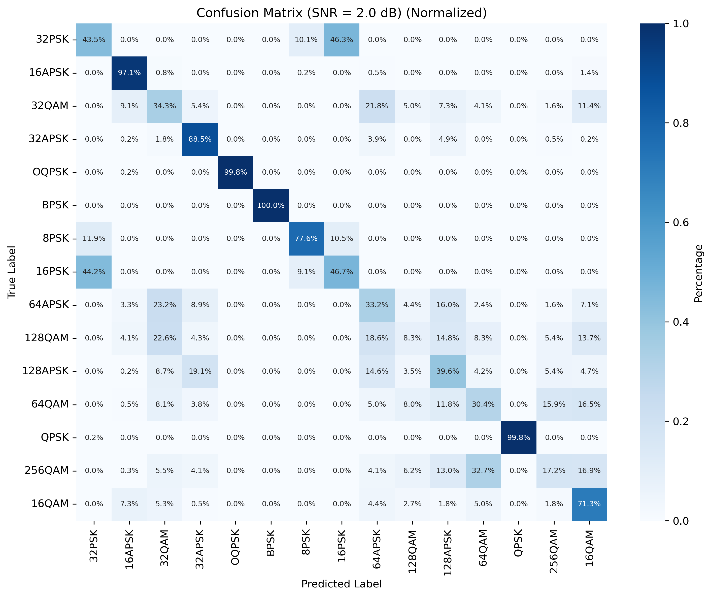</img> -->

    对比了其他的一些方法，很多过拟合的，导致出现精度很糟糕的情况，有些方法没能复现。
    文件树如下：
    <ul>
        <li>model  ---our model file
        </li>
        <li>model_compare  ---compared model
        </li>
        <li>runs
            <ul>
                <li>20250816-093022   ---test result and trained model
                </li>
            </ul>
        </li>
        <li>main_*.pth   ---compared model training
        </li>
        <li>test_*.pth   ---compared model testing
        </li>
    </ul>

